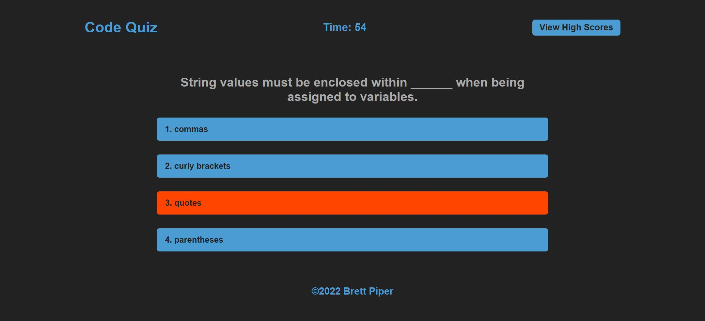

# Code Quiz

*Code Quiz screenshot*

## About

The challenge was to build a coding quiz game from scratch. With no starter code given, I was asked to use HTML, CSS, and JavaScript to develop a game where the user starts the game and is presented with questions until either all are answered or a timer hits zero, at which point the game will provide the user with their score and give them the ability to store that score and their initials in a leaderboard. The game includes the following additional features:

- The order in which questions appear is randomized each time the user plays the game
- Incorrect answers cause time to be deducted from the timer
- Correct answers and leftover time add to the score, based on tweakable multipliers
- After each question except the final one, pop-up text lets the user know whether their answer was correct
- High scores can be viewed at any time, and the scores can be cleared by the user
- The game can easily be expanded, as the number of questions and answer choices for each question is not constrained
- The game is responsive for mobile devices

## Contact

Brett Piper - <bpiper91@gmail.com>

Deployed quiz: <https://bpiper91.github.io/code-quiz>

GitHub repository: <https://github.com/bpiper91/code-quiz>